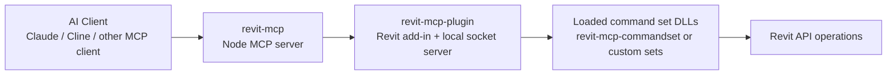
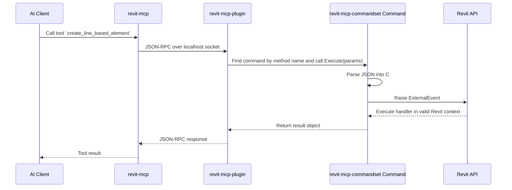

# How `revit-mcp`, `revit-mcp-plugin`, `revit-mcp-commandset` work together. - by Codex

## Overview

These three repositories are one end-to-end Revit AI system split into three runtime layers:

- `revit-mcp`: the MCP server that AI clients talk to
- `revit-mcp-plugin`: the Revit add-in that runs inside Revit
- `revit-mcp-commandset`: the actual library of Revit commands/features

At a high level:

1. An AI client calls a tool exposed by `revit-mcp`.
2. `revit-mcp` turns that into a JSON-RPC request over a local socket.
3. `revit-mcp-plugin` receives that request inside Revit.
4. The plugin finds the matching command from a loaded command set.
5. The command raises an `ExternalEvent`.
6. Revit executes the handler on a valid Revit API context.
7. The result flows back through the plugin, over the socket, to `revit-mcp`, and then to the AI client.

## The Three Repos

### `revit-mcp`

This is the AI-facing MCP server, written in TypeScript/Node.

Its responsibilities:

- register MCP tools for AI clients
- validate tool inputs
- connect to Revit over `localhost:8080`
- send JSON-RPC requests to the Revit plugin
- return responses back to the AI client

Important files:

- `src/index.ts`
- `src/tools/register.ts`
- `src/utils/ConnectionManager.ts`
- `src/utils/SocketClient.ts`

### `revit-mcp-plugin`

This is the Revit add-in, written in C#.

Its responsibilities:

- load inside the Revit process
- add the ribbon buttons and settings UI
- start and stop the local socket server
- discover available command-set DLLs
- dynamically load commands into a registry
- receive JSON-RPC requests and dispatch them

Important files:

- `revit-mcp-plugin/Core/Application.cs`
- `revit-mcp-plugin/Core/MCPServiceConnection.cs`
- `revit-mcp-plugin/Core/SocketService.cs`
- `revit-mcp-plugin/Core/CommandManager.cs`
- `revit-mcp-plugin/UI/CommandSetSettingsPage.xaml.cs`

### `revit-mcp-commandset`

This is the Revit feature library, also written in C#.

Its responsibilities:

- implement commands such as query/create/delete/tag/color/modify operations
- expose those features through `IRevitCommand`-compatible classes
- package version-specific DLLs so the plugin can load them

Important files:

- `revit-mcp-commandset/Commands/...`
- `revit-mcp-commandset/Services/...`
- `revit-mcp-commandset/Models/...`

## Runtime Diagram



## Why The Repos Are Separate

They are split mostly because of runtime boundaries:

- `revit-mcp` runs outside Revit as a normal Node process
- `revit-mcp-plugin` runs inside Revit as an add-in
- `revit-mcp-commandset` contains the feature implementations the plugin loads

This gives you modularity:

- AI/MCP behavior can change without rewriting Revit commands
- Revit features can grow without changing the MCP server
- custom command packs can be added later

## How Command Discovery Works

`revit-mcp-plugin` scans a `Commands` folder next to the built plugin output. A typical command-set folder looks like this:

```text
CommandSetName/
  command.json
  2020/
    some-commandset.dll
  2021/
    some-commandset.dll
  2022/
    some-commandset.dll
  2023/
    some-commandset.dll
  2024/
    some-commandset.dll
  2025/
    some-commandset.dll
```

The `command.json` file declares the commands exposed by that set. The plugin UI:

1. scans command-set folders
2. checks available Revit-version subfolders
3. builds the list of available commands
4. lets the user enable/disable them
5. saves enabled commands to `Commands/commandRegistry.json`

When the service starts, `CommandManager`:

1. loads `commandRegistry.json`
2. substitutes the current Revit version into the DLL path
3. loads the assembly by reflection
4. finds types implementing `IRevitCommand`
5. registers them by `CommandName`

That is how a JSON-RPC `method` ends up calling a concrete C# command class.

## Revit API vs Local Socket

The Revit API is not a socket API.

The Revit API is an in-process .NET API that only works when code is running inside Revit.

The socket is only the transport between:

- an external process (`revit-mcp`)
- and the in-Revit add-in (`revit-mcp-plugin`)

The mental model is:

```text
AI client -> MCP tool -> local socket -> Revit plugin -> ExternalEvent -> Revit API
```

## Example Command Flow: `create_line_based_element`

### Step 1. AI calls the MCP tool

The AI client calls a tool exposed by `revit-mcp` with input like:

```json
{
  "data": [
    {
      "name": "wall",
      "typeId": 123456,
      "locationLine": {
        "p0": { "x": 0, "y": 0, "z": 0 },
        "p1": { "x": 5000, "y": 0, "z": 0 }
      },
      "thickness": 200,
      "height": 3000,
      "baseLevel": 0,
      "baseOffset": 0
    }
  ]
}
```

### Step 2. `revit-mcp` sends JSON-RPC over the socket

It becomes a JSON-RPC request like this:

```json
{
  "jsonrpc": "2.0",
  "method": "create_line_based_element",
  "params": {
    "data": [
      {
        "name": "wall",
        "typeId": 123456,
        "locationLine": {
          "p0": { "x": 0, "y": 0, "z": 0 },
          "p1": { "x": 5000, "y": 0, "z": 0 }
        },
        "thickness": 200,
        "height": 3000,
        "baseLevel": 0,
        "baseOffset": 0
      }
    ]
  },
  "id": "12346"
}
```

In this system, JSON-RPC provides:

- the method name
- the parameter payload
- the request ID
- the standard success/error envelope

### Step 3. The plugin receives and routes the request

`revit-mcp-plugin`:

1. reads the JSON message from the socket
2. deserializes it into a JSON-RPC request model
3. looks up the command by `method`
4. calls that command's `Execute(...)`

If the method is `create_line_based_element`, the plugin finds the command whose `CommandName` is also `create_line_based_element`.

### Step 4. The command class parses the input

Inside `revit-mcp-commandset`, the command deserializes the JSON into C# models and prepares the handler:

```csharp
public override object Execute(JObject parameters, string requestId)
{
    List<LineElement> data = parameters["data"].ToObject<List<LineElement>>();
    _handler.SetParameters(data);

    if (RaiseAndWaitForCompletion(10000))
    {
        return _handler.Result;
    }
    else
    {
        throw new TimeoutException("Operation timed out");
    }
}
```

This is where:

- JSON becomes typed C# data
- the handler is set up
- an `ExternalEvent` is raised

## What `ExternalEvent` Means Here

Revit does not allow arbitrary background threads to directly modify the model.

That is why the command does not directly call the Revit API from the socket thread.

Instead:

- the socket thread receives the request
- the command raises an `ExternalEvent`
- Revit later invokes the handler on a valid Revit context
- the handler does the actual Revit work

So `ExternalEvent` is the safe handoff from background/network-triggered code into the Revit API execution context.

## What Revit API Means Here

Once inside the external event handler, the code is using the actual Revit API, with types such as:

- `UIApplication`
- `UIDocument`
- `Document`
- `FilteredElementCollector`
- `Transaction`
- `Wall`
- `XYZ`
- `Line`

A simplified wall-creation example looks like this:

```csharp
public void Execute(UIApplication app)
{
    Document doc = app.ActiveUIDocument.Document;

    using (Transaction trans = new Transaction(doc, "Create wall"))
    {
        trans.Start();

        XYZ startPoint = new XYZ(_startX, _startY, 0);
        XYZ endPoint = new XYZ(_endX, _endY, 0);
        Line curve = Line.CreateBound(startPoint, endPoint);

        Wall wall = Wall.Create(
            doc,
            curve,
            wallTypeId,
            levelId,
            _height,
            0.0,
            false,
            false);

        trans.Commit();
    }
}
```

This is not socket code anymore. This is direct, in-process Revit API code.

## The Full Example Sequence



## Another Simple Example: `get_current_view_info`

A read-only example uses the same pattern:

### Request

```json
{
  "jsonrpc": "2.0",
  "method": "get_current_view_info",
  "params": {},
  "id": "12345"
}
```

### Behavior

The command:

1. raises an `ExternalEvent`
2. asks Revit for the active view
3. reads its properties
4. returns a DTO/result object

### Typical response

```json
{
  "jsonrpc": "2.0",
  "id": "12345",
  "result": {
    "viewName": "Level 1",
    "viewType": "FloorPlan",
    "scale": 100
  }
}
```

## How The Shared SDK Fits In

All three repos rely on shared contracts from the Revit MCP SDK, including:

- `IRevitCommand`
- JSON-RPC request/response models
- base command classes like `ExternalEventCommandBase`
- Revit version adapters and related utilities

That SDK keeps the command contract consistent between the plugin, the commandset, and the naming conventions used by the MCP server.

## Can This Become One Product?

Yes.

Even though the repos are separate today, they can be treated as one product with three runtime layers.

The most practical single-product design would be:

- one monorepo
- one installer
- one release pipeline
- one Revit add-in
- one Node MCP server
- one built-in default command library

The runtime boundary between "outside Revit" and "inside Revit" would still likely remain, because that is a real technical constraint.

## Could The AI UI Live Inside Revit?

Yes.

Instead of relying only on an external MCP client, you could build a dockable Revit sidebar that acts like a Copilot UI. In that design:

- the chat UI lives inside Revit
- the add-in handles prompts and responses
- command execution still uses `ExternalEvent`
- the same command-library concepts still apply

## Final Mental Model

If you remember one thing, remember this:

```text
`revit-mcp` talks to AI
`revit-mcp-plugin` talks to Revit
`revit-mcp-commandset` contains the actual Revit features
```

And the command flow is:

```text
AI tool call
-> MCP tool handler
-> JSON-RPC over localhost
-> plugin command lookup
-> ExternalEvent
-> Revit API
-> result back out
```

## Final Summary

These repositories are separate so the system stays modular, but together they form one pipeline:

- `revit-mcp` exposes tools to AI clients
- `revit-mcp-plugin` hosts the bridge inside Revit
- `revit-mcp-commandset` implements the BIM operations

JSON-RPC is the transport format.

`ExternalEvent` is the safe execution handoff into Revit.

The Revit API is the actual in-process API that reads and modifies the model.

So the complete stack is:

```text
AI client
-> MCP server (`revit-mcp`)
-> local socket
-> Revit add-in (`revit-mcp-plugin`)
-> command library (`revit-mcp-commandset`)
-> Revit API
```
